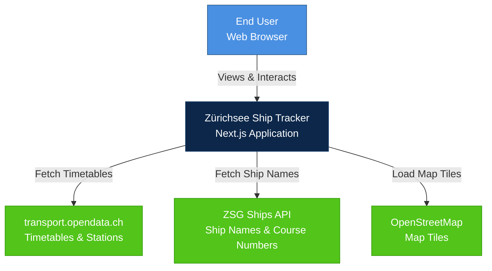
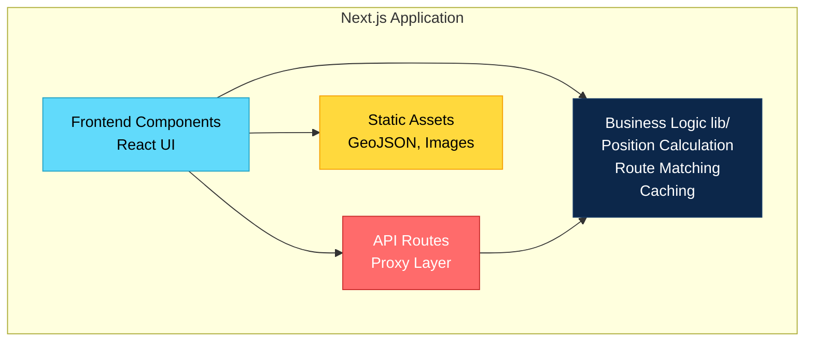
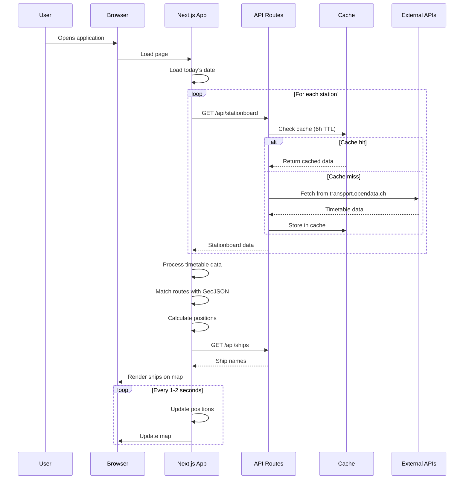
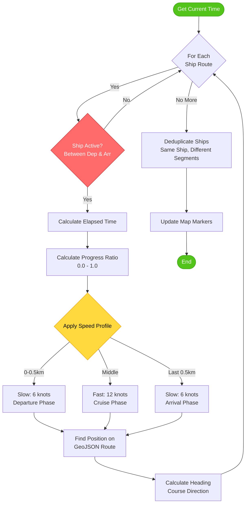
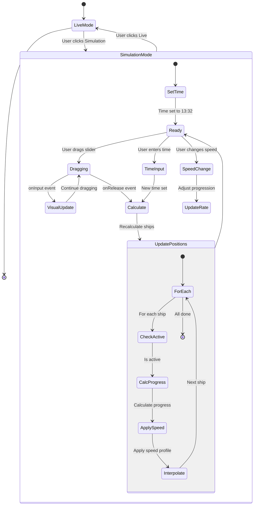
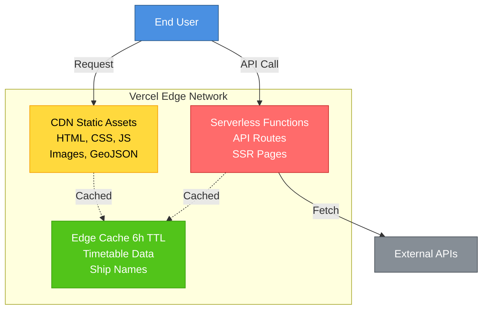
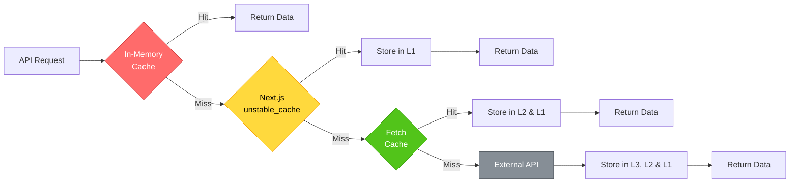

# arc42 Architecture Documentation
# Zürichsee Schifffahrt Live Tracker

**Version:** 1.0.0  
**Date:** January 2026  
**Author:** lakeshorestudios

---

## 1. Introduction and Goals

### 1.1 Requirements Overview

The Zürichsee Schifffahrt Live Tracker is a web application that visualizes ship movements on Lake Zurich in real-time. The application provides both live tracking and historical simulation capabilities.

**Key Features:**
- Real-time visualization of ship positions on an interactive map
- Time-based simulation with adjustable speed (1x-100x)
- Bilingual interface (German/English)
- Dark mode support
- Mobile-responsive design
- Built-in user documentation

### 1.2 Quality Goals

| Priority | Quality Goal | Scenario |
|----------|-------------|----------|
| 1 | **Performance** | Ship positions update smoothly without lag, even with multiple ships |
| 2 | **Usability** | Intuitive interface for both technical and non-technical users |
| 3 | **Reliability** | Graceful handling of API failures and rate limits |
| 4 | **Maintainability** | Clean, well-documented code structure |
| 5 | **Scalability** | Efficient caching to minimize API calls |

### 1.3 Stakeholders

| Role | Expectations |
|------|-------------|
| End Users | Easy-to-use interface, accurate ship positions, fast loading times |
| Developers | Clear code structure, good documentation, easy deployment |
| ZSG (Zürichsee Schifffahrtsgesellschaft) | Accurate representation of their timetable data |

---

## 2. Architecture Constraints

### 2.1 Technical Constraints

| Constraint | Description |
|------------|-------------|
| **Next.js 15** | Must use Next.js App Router architecture |
| **TypeScript** | All code must be type-safe |
| **Public APIs** | Can only use publicly accessible APIs (no API keys) |
| **Vercel Deployment** | Optimized for Vercel serverless architecture |
| **Browser Support** | Modern browsers (Chrome, Firefox, Safari, Edge) |

### 2.2 Organizational Constraints

| Constraint | Description |
|------------|-------------|
| **No Backend Database** | All data fetched from external APIs |
| **Rate Limiting** | Must respect API rate limits of transport.opendata.ch |
| **Open Source Dependencies** | Use only open-source libraries |

---

## 3. System Scope and Context

### 3.1 Business Context



### 3.2 Technical Context

**External Interfaces:**

1. **transport.opendata.ch API**
   - Protocol: HTTPS/REST
   - Format: JSON
   - Purpose: Timetable data, station information
   - Rate Limit: ~1000 requests/hour

2. **ZSG Ships API**
   - Protocol: HTTPS/REST
   - Format: JSON
   - Purpose: Ship names and course number mapping
   - Rate Limit: Unlimited (own API)

3. **OpenStreetMap Tiles**
   - Protocol: HTTPS
   - Format: PNG tiles
   - Purpose: Map visualization
   - Rate Limit: Fair use policy

---

## 4. Solution Strategy

### 4.1 Technology Decisions

| Decision | Rationale |
|----------|-----------|
| **Next.js 15** | Modern React framework with excellent performance, SSR, and API routes |
| **TypeScript** | Type safety reduces bugs and improves developer experience |
| **Leaflet** | Open-source, lightweight mapping library with good React integration |
| **Tailwind CSS** | Utility-first CSS for rapid UI development |
| **Vercel** | Optimal deployment platform for Next.js with edge caching |

### 4.2 Architectural Patterns

1. **Client-Server Architecture**: Next.js handles both frontend and backend
2. **API Proxy Pattern**: Internal API routes proxy external APIs to handle CORS and caching
3. **Multi-Layer Caching**: In-memory cache + Next.js cache + fetch cache
4. **Real-time Simulation**: Time-based position calculation with interpolation

### 4.3 Key Design Decisions

1. **No Database**: All data fetched from APIs, reducing infrastructure complexity
2. **GeoJSON Routes**: Pre-loaded route data for accurate ship paths
3. **Position Calculation**: Client-side calculation based on timetable data
4. **Aggressive Caching**: 6-hour cache to minimize API calls

---

## 5. Building Block View

### 5.1 Level 1: System Overview



### 5.2 Level 2: Component Breakdown

#### Frontend Components

```
app/
├── page.tsx              # Main application logic
├── layout.tsx            # Root layout with providers
└── globals.css           # Global styles

components/
├── ShipMap.tsx           # Leaflet map with ship markers
├── SchedulePanel.tsx     # Ship list sidebar
├── Documentation.tsx     # User documentation modal
├── Footer.tsx            # Footer with credits
└── ThemeLanguageToggle.tsx # Theme & language switcher
```

#### Business Logic (lib/)

```
lib/
├── transport-api.ts      # Transport API client with caching
├── ship-position.ts      # Position calculation engine
├── ship-names-api.ts     # Ship name resolution
├── geojson-routes.ts     # Route loading and matching
├── zurichsee-stations.ts # Station coordinates
├── i18n.ts               # Translations
├── i18n-context.tsx      # i18n React context
└── theme.tsx             # Theme management
```

#### API Routes

```
app/api/
├── stationboard/
│   └── route.ts          # Proxy for transport.opendata.ch
└── ships/
    └── route.ts          # Proxy for ZSG Ships API
```

---

## 6. Runtime View

### 6.1 Scenario: Loading Ship Positions (Live Mode)



### 6.2 Scenario: Position Calculation



### 6.3 Scenario: Simulation Mode



---

## 7. Deployment View

### 7.1 Vercel Deployment Architecture



### 7.2 Infrastructure Requirements

- **Compute**: Vercel Serverless Functions (Node.js 18+)
- **Storage**: No persistent storage required
- **CDN**: Vercel Edge Network for static assets
- **Caching**: Edge cache + in-memory cache

---

## 8. Cross-cutting Concepts

### 8.1 Caching Strategy

**Three-Layer Cache Architecture:**



**Layer Details:**

1. **In-Memory Cache** (API Routes)
   - Duration: 6 hours
   - Scope: Per serverless function instance
   - Purpose: Fast repeated access

2. **Next.js unstable_cache** (Server-side)
   - Duration: 6 hours
   - Scope: Across function invocations
   - Purpose: Persistent server cache

3. **Fetch Cache** (Next.js)
   - Duration: 6 hours
   - Scope: Per request
   - Purpose: HTTP response caching

### 8.2 Error Handling

**Graceful Degradation:**
- API failures return empty arrays instead of errors
- Retry logic with exponential backoff (3 retries)
- Fallback to linear interpolation if GeoJSON routes not found
- User-friendly error messages in UI

### 8.3 Internationalization (i18n)

- Language detection from browser settings
- Supported languages: German (de), English (en)
- Context-based translation system
- All user-facing text is translatable

### 8.4 Performance Optimization

- **Code Splitting**: Dynamic imports for heavy components
- **Image Optimization**: Next.js automatic image optimization
- **Lazy Loading**: Map tiles loaded on demand
- **Debouncing**: Timeline slider updates debounced
- **Memoization**: React.memo and useMemo for expensive calculations

---

## 9. Architecture Decisions

### 9.1 ADR-001: Use GeoJSON for Routes

**Context**: Need accurate ship paths between stations

**Decision**: Use pre-loaded GeoJSON file from OpenStreetMap

**Consequences**:
- ✅ Accurate routes based on real maritime data
- ✅ No runtime API calls for route data
- ❌ Routes must be manually updated if changed

### 9.2 ADR-002: Client-Side Position Calculation

**Context**: Need real-time ship position updates

**Decision**: Calculate positions client-side based on timetable data

**Consequences**:
- ✅ No backend required
- ✅ Instant updates without API calls
- ❌ Positions are estimates, not GPS data

### 9.3 ADR-003: 6-Hour Cache Duration

**Context**: Balance between fresh data and API rate limits

**Decision**: Cache timetable data for 6 hours

**Consequences**:
- ✅ Reduces API calls significantly
- ✅ Respects rate limits
- ❌ Schedule changes take up to 6 hours to appear

### 9.4 ADR-004: No Date Picker in Simulation

**Context**: Simulation always uses today's date

**Decision**: Remove date picker, always use current date

**Consequences**:
- ✅ Simpler UI
- ✅ Prevents confusion about historical data
- ❌ Cannot simulate past or future dates

---

## 10. Quality Requirements

### 10.1 Performance

| Metric | Target | Measurement |
|--------|--------|-------------|
| Initial Load Time | < 3s | Lighthouse |
| Time to Interactive | < 5s | Lighthouse |
| Position Update Rate | 1-2s | Manual testing |
| Map Tile Loading | < 1s | Manual testing |

### 10.2 Usability

- Intuitive UI requiring no training
- Clear visual feedback for all actions
- Mobile-responsive design
- Built-in documentation

### 10.3 Reliability

- Graceful handling of API failures
- Automatic retry with exponential backoff
- No crashes on invalid data
- Fallback mechanisms for missing routes

---

## 11. Risks and Technical Debt

### 11.1 Risks

| Risk | Probability | Impact | Mitigation |
|------|------------|--------|------------|
| API Rate Limiting | Medium | High | Aggressive caching, retry logic |
| API Downtime | Low | Medium | Error handling, fallback data |
| GeoJSON Outdated | Low | Low | Manual update process |
| Browser Compatibility | Low | Medium | Use modern web standards |

### 11.2 Technical Debt

1. **Manual GeoJSON Updates**: Routes must be manually updated from OpenStreetMap
2. **No Real GPS Data**: Positions are calculated, not actual GPS
3. **Limited Error Logging**: No centralized error tracking system
4. **No Analytics**: No usage tracking or performance monitoring

---

## 12. Glossary

| Term | Definition |
|------|------------|
| **ZSG** | Zürichsee Schifffahrtsgesellschaft (Lake Zurich Shipping Company) |
| **Course Number** | Unique identifier for a ship route (e.g., "29", "2529") |
| **Stationboard** | Timetable showing departures/arrivals at a station |
| **GeoJSON** | Geographic data format based on JSON |
| **Haversine Formula** | Formula to calculate distance between two points on Earth |
| **Timeline Slider** | UI control to scrub through time in simulation mode |
| **Dwell Time** | Time a ship stays at a station between arrival and departure |
| **Edge Cache** | CDN cache at Vercel edge locations |
| **Serverless Function** | Function that runs on-demand without a persistent server |

---

**Document Version:** 1.0.0  
**Last Updated:** January 22, 2026  
**Next Review:** June 2026
