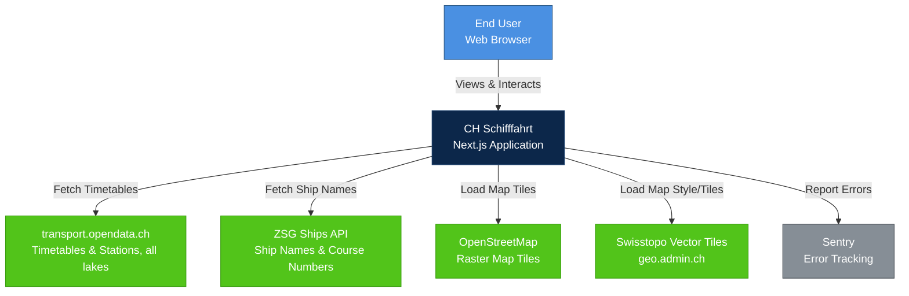
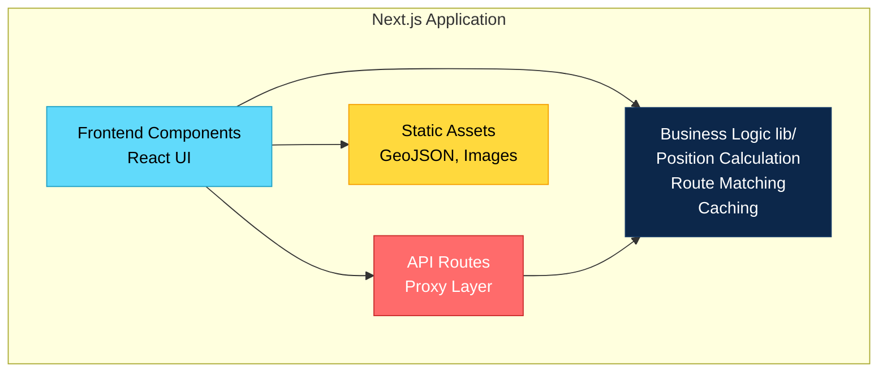
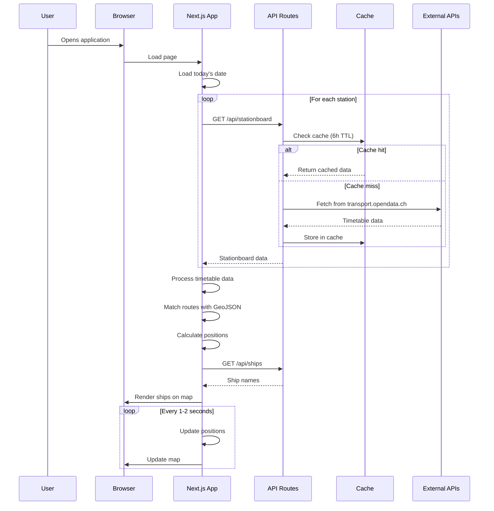
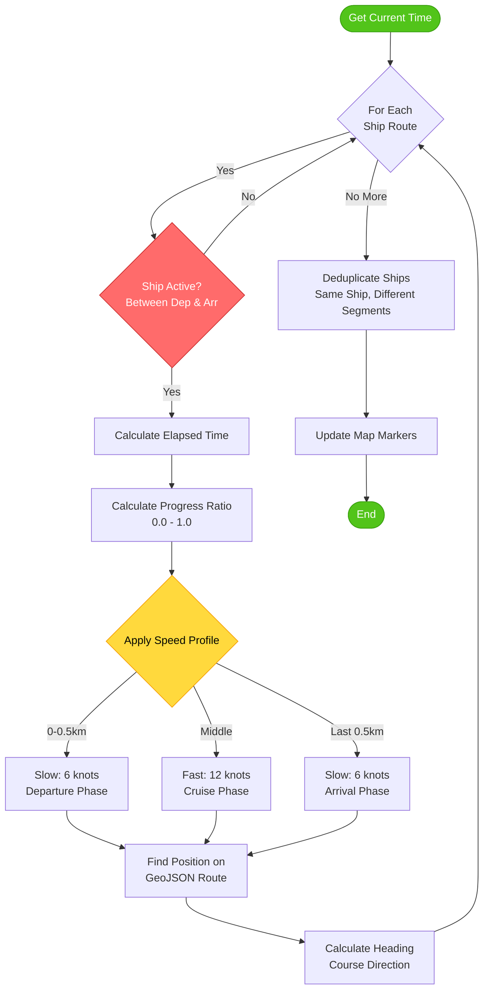
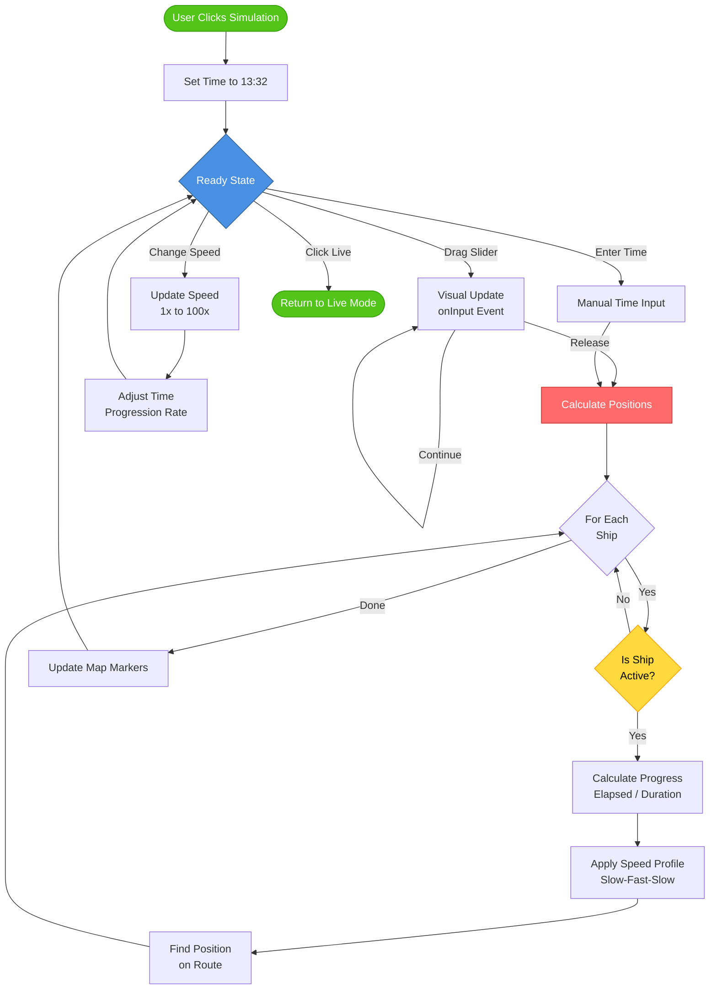
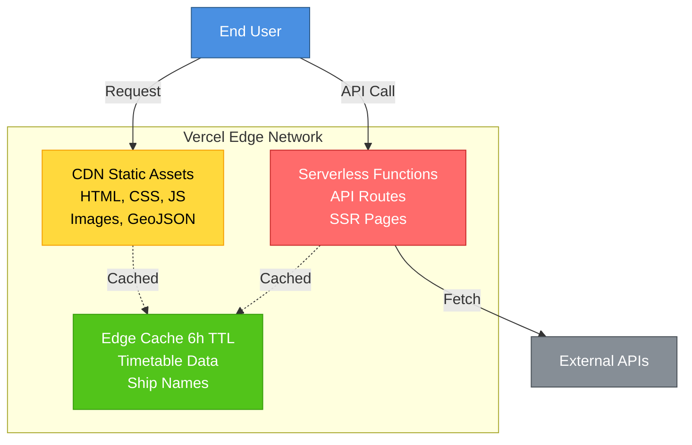
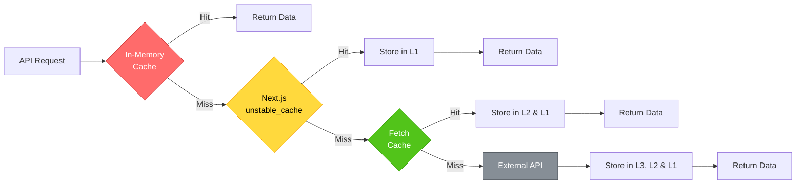

# arc42 Architecture Documentation
# CH Schifffahrt – Swiss Lake & River Ship Tracker

**Version:** 1.5.0  
**Date:** August 2026  
**Author:** lakeshorestudios

---

## 1. Introduction and Goals

### 1.1 Requirements Overview

CH Schifffahrt is a web application that visualizes ship movements on Swiss (and adjacent international) lakes and rivers in real-time. What started as a single-lake tracker for Lake Zurich has grown into a multi-lake platform: nearly 20 lakes and river stretches are configured, each independently enabled via an admin allow-list. The application provides both live tracking and historical simulation capabilities.

**Key Features:**
- Real-time visualization of ship positions on an interactive map, across many Swiss lakes plus international waters (Bodensee, Lac Léman, Lago Maggiore, Lago di Lugano)
- Focused "corridor" views for specific river stretches (e.g. Aare between Biel/Bienne and Solothurn, Rhein near Schaffhausen) alongside full-lake views
- Admin-controlled rollout: lakes can be enabled/disabled without a deploy via `data/admin-config.json`
- Choice of basemap: OpenStreetMap raster tiles or the official Swisstopo vector basemap
- Time-based simulation with adjustable speed (1x-100x)
- Bilingual interface (German/English)
- Dark mode support
- Mobile-responsive design
- Built-in user documentation and release notes

### 1.2 Quality Goals

| Priority | Quality Goal | Scenario |
|----------|-------------|----------|
| 1 | **Performance** | Ship positions update smoothly without lag, even with multiple ships |
| 2 | **Usability** | Intuitive interface for both technical and non-technical users |
| 3 | **Reliability** | Graceful handling of API failures and rate limits |
| 4 | **Maintainability** | Clean, well-documented code structure |
| 5 | **Scalability** | Efficient caching to minimize API calls |

### 1.3 Stakeholders

| Role | Expectations |
|------|-------------|
| End Users | Easy-to-use interface, accurate ship positions, fast loading times |
| Developers | Clear code structure, good documentation, easy deployment |
| Shipping Operators (ZSG, BSG, SBS, URh, CGN, SNL, SGV, and others) | Accurate representation of their timetable data across all supported lakes |

---

## 2. Architecture Constraints

### 2.1 Technical Constraints

| Constraint | Description |
|------------|-------------|
| **Next.js 15** | Must use Next.js App Router architecture |
| **TypeScript** | All code must be type-safe |
| **Public APIs** | Can only use publicly accessible APIs (no API keys) |
| **Vercel Deployment** | Optimized for Vercel serverless architecture |
| **Browser Support** | Modern browsers (Chrome, Firefox, Safari, Edge) |

### 2.2 Organizational Constraints

| Constraint | Description |
|------------|-------------|
| **No Backend Database** | All data fetched from external APIs |
| **Rate Limiting** | Must respect API rate limits of transport.opendata.ch |
| **Open Source Dependencies** | Use only open-source libraries |

---

## 3. System Scope and Context

### 3.1 Business Context


```mermaid
graph TB
    User[End User<br/>Web Browser]
    App[CH Schifffahrt<br/>Next.js Application]
    Transport[transport.opendata.ch<br/>Timetables & Stations, all lakes]
    Ships[ZSG Ships API<br/>Ship Names & Course Numbers]
    OSM[OpenStreetMap<br/>Raster Map Tiles]
    Swisstopo[Swisstopo Vector Tiles<br/>geo.admin.ch]
    Sentry[Sentry<br/>Error Tracking]
    
    User -->|Views & Interacts| App
    App -->|Fetch Timetables| Transport
    App -->|Fetch Ship Names| Ships
    App -->|Load Map Tiles| OSM
    App -->|Load Map Style/Tiles| Swisstopo
    App -->|Report Errors| Sentry
    
    style App fill:#0c274a,stroke:#163a66,color:#fff
    style User fill:#4a90e2,stroke:#2e5c8a,color:#fff
    style Transport fill:#52c41a,stroke:#389e0d,color:#fff
    style Ships fill:#52c41a,stroke:#389e0d,color:#fff
    style OSM fill:#52c41a,stroke:#389e0d,color:#fff
    style Swisstopo fill:#52c41a,stroke:#389e0d,color:#fff
    style Sentry fill:#868e96,stroke:#495057,color:#fff
```

### 3.2 Technical Context

**External Interfaces:**

1. **transport.opendata.ch API**
   - Protocol: HTTPS/REST
   - Format: JSON
   - Purpose: Timetable data, station information — the single data source for **all** lakes/rivers, not just Lake Zurich
   - Rate Limit: ~1000 requests/hour
   - Coverage caveat: coverage is uneven for international shores (e.g. French/Italian/German harbors); some real-world stops exist in the feed but currently show no scheduled courses, others aren't in the feed at all (see §11)

2. **ZSG Ships API**
   - Protocol: HTTPS/REST
   - Format: JSON
   - Purpose: Ship names and course number mapping (Lake Zurich only — `hasShipNames` flag per lake)
   - Rate Limit: Unlimited (own API)

3. **OpenStreetMap Tiles**
   - Protocol: HTTPS
   - Format: PNG raster tiles
   - Purpose: Default/fallback map visualization
   - Rate Limit: Fair use policy

4. **Swisstopo Vector Tiles** (`vectortiles.geo.admin.ch`)
   - Protocol: HTTPS, MapLibre GL vector tile style (`ch.swisstopo.lightbasemap.vt`)
   - Purpose: Official Swiss basemap, shown by default; falls back to OpenStreetMap on load error
   - Note: significantly heavier per-tile payload than OSM raster tiles (see §8.4); the MapLibre GL client library is lazy-loaded so it isn't downloaded by users who stay on OpenStreetMap

5. **Sentry**
   - Protocol: HTTPS
   - Purpose: Client/server error tracking and monitoring

---

## 4. Solution Strategy

### 4.1 Technology Decisions

| Decision | Rationale |
|----------|-----------|
| **Next.js 15** | Modern React framework with excellent performance, SSR, and API routes |
| **TypeScript** | Type safety reduces bugs and improves developer experience |
| **Leaflet** | Open-source, lightweight mapping library with good React integration |
| **Tailwind CSS** | Utility-first CSS for rapid UI development |
| **Vercel** | Optimal deployment platform for Next.js with edge caching |
| **MapLibre GL + Leaflet** | Swisstopo's official style is vector-tile based (MapLibre GL); bridged into the existing Leaflet map via `@maplibre/maplibre-gl-leaflet` rather than replacing Leaflet outright |
| **Sentry** | Error tracking without maintaining custom logging infrastructure |

### 4.2 Architectural Patterns

1. **Client-Server Architecture**: Next.js handles both frontend and backend
2. **API Proxy Pattern**: Internal API routes proxy external APIs to handle CORS and caching
3. **Multi-Layer Caching**: In-memory cache + Next.js cache + fetch cache
4. **Real-time Simulation**: Time-based position calculation with interpolation
5. **Per-Lake Configuration Modules**: Each lake/river is a self-contained config unit (station list + name-mapping table + GeoJSON path); adding a lake means adding a module, not editing shared data
6. **Admin Allow-List for Rollout**: A lake can exist in code but stay hidden from the selector until added to `data/admin-config.json` — lets a lake's data be built and reviewed before it's user-visible

### 4.3 Key Design Decisions

1. **No Database**: All data fetched from APIs, reducing infrastructure complexity
2. **GeoJSON Routes**: Pre-loaded route data for accurate ship paths
3. **Position Calculation**: Client-side calculation based on timetable data
4. **Aggressive Caching**: 6-hour cache to minimize API calls
5. **Manual Station Data, Verified Against Live Feeds**: Station coordinates/UIC references are hand-maintained per lake rather than derived purely from GeoJSON, because GeoJSON point data is incomplete/inconsistent across lakes; each addition is cross-checked against `transport.opendata.ch` live stationboards to catch coordinate and name-mapping errors before they ship (see §11 for cases where this caught real bugs)

---

## 5. Building Block View

### 5.1 Level 1: System Overview


```mermaid
graph TB
    subgraph "Next.js Application"
        Frontend[Frontend Components<br/>React UI]
        API[API Routes<br/>Proxy Layer]
        Static[Static Assets<br/>GeoJSON, Images]
        Logic[Business Logic lib/<br/>Position Calculation<br/>Route Matching<br/>Caching]
        
        Frontend --> Logic
        Frontend --> API
        Frontend --> Static
        API --> Logic
    end
    
    style Frontend fill:#61dafb,stroke:#21a1c4,color:#000
    style API fill:#ff6b6b,stroke:#c92a2a,color:#fff
    style Static fill:#ffd93d,stroke:#f59f00,color:#000
    style Logic fill:#0c274a,stroke:#163a66,color:#fff
```

### 5.2 Level 2: Component Breakdown

#### Frontend Components

```
app/
├── page.tsx              # Main application logic
├── layout.tsx            # Root layout with providers
└── globals.css           # Global styles

components/
├── ShipMap.tsx           # Leaflet map with ship markers
├── SchedulePanel.tsx     # Ship list sidebar
├── Documentation.tsx     # User documentation modal
├── Footer.tsx            # Footer with credits
└── ThemeLanguageToggle.tsx # Theme & language switcher
```

#### Business Logic (lib/)

```
lib/
├── transport-api.ts      # Transport API client with caching
├── ship-position.ts      # Position calculation engine, GeoJSON route matching
├── ship-names-api.ts     # Ship name resolution (Zürichsee only)
├── geojson-routes.ts     # Ferry-stop extraction & route loading from GeoJSON
├── lakes-config.ts       # LAKES registry, per-lake loadLakeData(), connected-lake logic
├── admin-config.ts       # Reads data/admin-config.json (enabled-lakes allow-list)
├── stations/             # One module per lake/river, self-contained
│   ├── zurichsee.ts       #   Station[] + name-mapping Record<string,string>
│   ├── bielersee.ts
│   ├── aaresolothurn.ts   #   focused "corridor" view, shares data with bielersee.ts
│   ├── bodensee.ts
│   ├── rheinschaffhausen.ts # focused "corridor" view, shares data with bodensee.ts
│   ├── genfersee.ts
│   ├── lagomaggiore.ts
│   ├── luganersee.ts
│   └── ... (one file per configured lake)
├── i18n.ts               # Translations
├── i18n-context.tsx      # i18n React context
└── theme.tsx             # Theme management
```

**Lake Configuration & Station Data Architecture** (see also ADR-005 to ADR-007):

- `LAKES` in `lakes-config.ts` is a registry of `LakeConfig` entries (id, display name, initial map center/zoom, GeoJSON path). Adding a lake means adding one entry here, one `stations/*.ts` module, one branch in the `loadLakeData()` loader, and one line in the internal `lakeNames` lookup — four places kept in sync by convention, not by the type system (flagged as technical debt in §11).
- `loadLakeData(lakeId)` merges two station sources: the **manual** list from `stations/<lake>.ts` (authoritative name, coordinates, UIC reference) and any **additional** named ferry points found by scanning the lake's GeoJSON file (`getCachedFerryStations`). Manual entries always win by name; GeoJSON only *adds* stations the manual list doesn't already have.
  - **Gotcha**: this merge has no concept of "only part of this GeoJSON file" — it pulls in *every* named ferry point from the referenced file. The two "corridor" lakes (`rheinschaffhausen`, `aaresolothurn`) therefore use their **own**, deliberately trimmed GeoJSON files (route geometry only, no point features) rather than reusing the parent lake's full GeoJSON — otherwise the corridor's station list would silently include the whole parent lake.
- `getConnectedLakes()` / `CONNECTED_THREE_LAKES` lets several lakes load and render together as one combined view (currently Bielersee, Neuenburgersee, Murtensee, which are physically connected by canals). Station names must be unique across any set of lakes that can be connected this way — a real bug was found and fixed where Bielersee and Neuenburgersee both had an unrelated station literally named `"Port"`, and the later one silently overwrote the former's coordinates in the shared lookup map (see §11).
- `data/admin-config.json` (`{ enabledLakes: string[] }`), served via `app/api/admin/enabled-lakes`, gates which `LAKES` entries actually appear in the UI selector. A lake can be fully built and merged into `main` while remaining invisible to end users until added to this list — used repeatedly during the multi-lake rollout to build and verify a lake's data before enabling it.

#### API Routes

```
app/api/
├── stationboard/
│   └── route.ts          # Proxy for transport.opendata.ch (all lakes)
├── ships/
│   └── route.ts          # Proxy for ZSG Ships API (Zürichsee)
└── admin/
    └── enabled-lakes/
        └── route.ts       # Serves the lake allow-list from data/admin-config.json
```

---

## 6. Runtime View

### 6.1 Scenario: Loading Ship Positions (Live Mode)


```mermaid
sequenceDiagram
    participant User
    participant Browser
    participant App as Next.js App
    participant API as API Routes
    participant Cache
    participant External as External APIs
    
    User->>Browser: Opens application
    Browser->>App: Load page
    App->>App: Load today's date
    
    loop For each station
        App->>API: GET /api/stationboard
        API->>Cache: Check cache (6h TTL)
        alt Cache hit
            Cache-->>API: Return cached data
        else Cache miss
            API->>External: Fetch from transport.opendata.ch
            External-->>API: Timetable data
            API->>Cache: Store in cache
        end
        API-->>App: Stationboard data
    end
    
    App->>App: Process timetable data
    App->>App: Match routes with GeoJSON
    App->>App: Calculate positions
    App->>API: GET /api/ships
    API-->>App: Ship names
    App->>Browser: Render ships on map
    
    loop Every 1-2 seconds
        App->>App: Update positions
        App->>Browser: Update map
    end
```

### 6.2 Scenario: Position Calculation


```mermaid
flowchart TD
    Start([Get Current Time]) --> Loop{For Each<br/>Ship Route}
    Loop -->|Yes| Active{Ship Active?<br/>Between Dep & Arr}
    Active -->|No| Loop
    Active -->|Yes| Elapsed[Calculate Elapsed Time]
    Elapsed --> Progress[Calculate Progress Ratio<br/>0.0 - 1.0]
    Progress --> Speed{Apply Speed Profile}
    
    Speed -->|0-0.5km| Slow1[Slow: 6 knots<br/>Departure Phase]
    Speed -->|Middle| Fast[Fast: 12 knots<br/>Cruise Phase]
    Speed -->|Last 0.5km| Slow2[Slow: 6 knots<br/>Arrival Phase]
    
    Slow1 --> Position[Find Position on<br/>GeoJSON Route]
    Fast --> Position
    Slow2 --> Position
    
    Position --> Heading[Calculate Heading<br/>Course Direction]
    Heading --> Loop
    
    Loop -->|No More| Dedup[Deduplicate Ships<br/>Same Ship, Different Segments]
    Dedup --> Update[Update Map Markers]
    Update --> End([End])
    
    style Start fill:#52c41a,stroke:#389e0d,color:#fff
    style End fill:#52c41a,stroke:#389e0d,color:#fff
    style Active fill:#ff6b6b,stroke:#c92a2a,color:#fff
    style Speed fill:#ffd93d,stroke:#f59f00,color:#000
```

### 6.3 Scenario: Simulation Mode


```mermaid
flowchart TD
    Start([User Clicks Simulation]) --> SetTime[Set Time to 13:32]
    SetTime --> Ready{Ready State}
    
    Ready -->|Drag Slider| Dragging[Visual Update<br/>onInput Event]
    Dragging -->|Continue| Dragging
    Dragging -->|Release| Calculate
    
    Ready -->|Change Speed| SpeedChange[Update Speed<br/>1x to 100x]
    SpeedChange --> UpdateRate[Adjust Time<br/>Progression Rate]
    UpdateRate --> Ready
    
    Ready -->|Enter Time| TimeInput[Manual Time Input]
    TimeInput --> Calculate
    
    Calculate[Calculate Positions] --> Loop{For Each<br/>Ship}
    Loop -->|Yes| CheckActive{Is Ship<br/>Active?}
    CheckActive -->|No| Loop
    CheckActive -->|Yes| CalcProgress[Calculate Progress<br/>Elapsed / Duration]
    CalcProgress --> ApplySpeed[Apply Speed Profile<br/>Slow-Fast-Slow]
    ApplySpeed --> Interpolate[Find Position<br/>on Route]
    Interpolate --> Loop
    Loop -->|Done| UpdateMap[Update Map Markers]
    UpdateMap --> Ready
    
    Ready -->|Click Live| End([Return to Live Mode])
    
    style Start fill:#52c41a,stroke:#389e0d,color:#fff
    style End fill:#52c41a,stroke:#389e0d,color:#fff
    style Ready fill:#4a90e2,stroke:#2e5c8a,color:#fff
    style Calculate fill:#ff6b6b,stroke:#c92a2a,color:#fff
    style CheckActive fill:#ffd93d,stroke:#f59f00,color:#000
```

---

## 7. Deployment View

### 7.1 Vercel Deployment Architecture


```mermaid
graph TB
    subgraph "Vercel Edge Network"
        CDN[CDN Static Assets<br/>HTML, CSS, JS<br/>Images, GeoJSON]
        Functions[Serverless Functions<br/>API Routes<br/>SSR Pages]
        EdgeCache[Edge Cache 6h TTL<br/>Timetable Data<br/>Ship Names]
        
        CDN -.->|Cached| EdgeCache
        Functions -.->|Cached| EdgeCache
    end
    
    User[End User] -->|Request| CDN
    User -->|API Call| Functions
    Functions -->|Fetch| External[External APIs]
    
    style CDN fill:#ffd93d,stroke:#f59f00,color:#000
    style Functions fill:#ff6b6b,stroke:#c92a2a,color:#fff
    style EdgeCache fill:#52c41a,stroke:#389e0d,color:#fff
    style User fill:#4a90e2,stroke:#2e5c8a,color:#fff
    style External fill:#868e96,stroke:#495057,color:#fff
```

### 7.2 Infrastructure Requirements

- **Compute**: Vercel Serverless Functions (Node.js 18+)
- **Storage**: No persistent storage required
- **CDN**: Vercel Edge Network for static assets
- **Caching**: Edge cache + in-memory cache

---

## 8. Cross-cutting Concepts

### 8.1 Caching Strategy

**Three-Layer Cache Architecture:**


```mermaid
graph LR
    Request[API Request] --> L1{In-Memory<br/>Cache}
    L1 -->|Hit| Return1[Return Data]
    L1 -->|Miss| L2{Next.js<br/>unstable_cache}
    L2 -->|Hit| Store1[Store in L1] --> Return2[Return Data]
    L2 -->|Miss| L3{Fetch<br/>Cache}
    L3 -->|Hit| Store2[Store in L2 & L1] --> Return3[Return Data]
    L3 -->|Miss| API[External API]
    API --> Store3[Store in L3, L2 & L1] --> Return4[Return Data]
    
    style L1 fill:#ff6b6b,stroke:#c92a2a,color:#fff
    style L2 fill:#ffd93d,stroke:#f59f00,color:#000
    style L3 fill:#52c41a,stroke:#389e0d,color:#fff
    style API fill:#868e96,stroke:#495057,color:#fff
```

**Layer Details:**

1. **In-Memory Cache** (API Routes)
   - Duration: 6 hours
   - Scope: Per serverless function instance
   - Purpose: Fast repeated access

2. **Next.js unstable_cache** (Server-side)
   - Duration: 6 hours
   - Scope: Across function invocations
   - Purpose: Persistent server cache

3. **Fetch Cache** (Next.js)
   - Duration: 6 hours
   - Scope: Per request
   - Purpose: HTTP response caching

### 8.2 Error Handling

**Graceful Degradation:**
- API failures return empty arrays instead of errors (`/api/stationboard` catches connect timeouts and upstream 4xx/5xx and responds `200 { stationboard: [] }` rather than propagating a 500 — confirmed in production when `transport.opendata.ch` was temporarily unreachable and the app degraded to "no departures for that station" instead of crashing)
- Retry logic with exponential backoff (3 retries)
- Fallback to linear interpolation if GeoJSON routes not found
- User-friendly error messages in UI
- **Sentry** captures unhandled exceptions client- and server-side for later investigation

### 8.3 Internationalization (i18n)

- Language detection from browser settings
- Supported languages: German (de), English (en)
- Context-based translation system
- All user-facing text is translatable

### 8.4 Performance Optimization

- **Code Splitting**: Dynamic imports for heavy components; the MapLibre GL library (~280 KB gzip) is loaded via a runtime `import()` inside the Swisstopo layer's effect instead of a static `require()`, so it lands in its own chunk and is only fetched when the Swisstopo style is actually active — users who stay on OpenStreetMap never download it
- **Connection Preconnect**: `<link rel="preconnect">` hints for `vectortiles.geo.admin.ch` and its tile-shard subdomains, so the first Swisstopo tile/style request doesn't pay full DNS+TLS setup latency on top of the fetch itself
- **Image Optimization**: Next.js automatic image optimization
- **Lazy Loading**: Map tiles loaded on demand
- **Debouncing**: Timeline slider updates debounced
- **Memoization**: React.memo and useMemo for expensive calculations
- **Vector vs. raster tile cost**: Swisstopo's vector tiles are measured at roughly 35–40x the payload of an equivalent OpenStreetMap raster tile at the same zoom level (plus style/sprite/glyph fetches and client-side rendering of ~66 style layers) — a structural cost of the vector basemap, not a bug, and the reason OSM still exists as a lighter fallback option

---

## 9. Architecture Decisions

### 9.1 ADR-001: Use GeoJSON for Routes

**Context**: Need accurate ship paths between stations

**Decision**: Use pre-loaded GeoJSON file from OpenStreetMap

**Consequences**:
- ✅ Accurate routes based on real maritime data
- ✅ No runtime API calls for route data
- ❌ Routes must be manually updated if changed

### 9.2 ADR-002: Client-Side Position Calculation

**Context**: Need real-time ship position updates

**Decision**: Calculate positions client-side based on timetable data

**Consequences**:
- ✅ No backend required
- ✅ Instant updates without API calls
- ❌ Positions are estimates, not GPS data

### 9.3 ADR-003: 6-Hour Cache Duration

**Context**: Balance between fresh data and API rate limits

**Decision**: Cache timetable data for 6 hours

**Consequences**:
- ✅ Reduces API calls significantly
- ✅ Respects rate limits
- ❌ Schedule changes take up to 6 hours to appear

### 9.4 ADR-004: No Date Picker in Simulation

**Context**: Simulation always uses today's date

**Decision**: Remove date picker, always use current date

**Consequences**:
- ✅ Simpler UI
- ✅ Prevents confusion about historical data
- ❌ Cannot simulate past or future dates

### 9.5 ADR-005: Per-Lake Station Modules Instead of a Shared Database

**Context**: Growing from one lake to nearly 20 lakes/rivers needed a way to add a lake's station data without a database or admin UI

**Decision**: Each lake is a self-contained TypeScript module (`lib/stations/<lake>.ts`) exporting a station array and a name-mapping table, wired into a `LAKES` registry and a `loadLakeData()` loader in `lakes-config.ts`

**Consequences**:
- ✅ A new lake is a reviewable code change (diffable, type-checked), not a data migration
- ✅ No database/CMS needed
- ❌ Adding a lake touches four separate spots (`LAKES`, the loader's switch/if-chain, the `lakeNames` lookup, `admin-config.json`) instead of one — a `loader` field on `LakeConfig` could collapse this later
- ❌ Station names must stay unique within any set of lakes that can be loaded together (see §11 — this was violated once and caused a real bug)

### 9.6 ADR-006: Admin Allow-List for Gradual Lake Rollout

**Context**: New lakes' station data is verified against live feeds but each addition still carries some risk (wrong coordinates, unmapped name variants); shipping a broken lake straight to all users is undesirable

**Decision**: `data/admin-config.json` holds an `enabledLakes` array; only lakes in this list appear in the UI selector, independent of whether they're implemented in code

**Consequences**:
- ✅ A lake's implementation and its public visibility are decoupled — code can be merged and even deployed before a lake goes live
- ✅ Disabling a broken lake is a one-line config change, no redeploy of application logic needed
- ❌ Yet another place that must be kept in sync when adding a lake (see ADR-005)

### 9.7 ADR-007: Focused "Corridor" Views Share Station Data, Not Files

**Context**: Some users only care about one river stretch (e.g. the Rhine near Schaffhausen, the Aare near Solothurn) rather than the whole connected lake/network

**Decision**: Give these stretches their own `LakeConfig` entry and their own `stations/*.ts` module with a duplicated (not imported) copy of the relevant subset of stations, plus a dedicated, trimmed GeoJSON file containing only that stretch's route geometry

**Consequences**:
- ✅ The corridor view's station list and drawn route stay exactly scoped to the intended area — reusing the parent lake's full GeoJSON would have pulled in every named stop from the whole lake via the GeoJSON-merge step in `loadLakeData()`
- ✅ Simple, consistent with how every other lake module is already self-contained
- ❌ Duplicated station data: a coordinate/UIC fix applied to the parent lake's file (e.g. `bielersee.ts`) must be manually re-applied to the corridor file (e.g. `aaresolothurn.ts`) or the two views will drift apart

### 9.8 ADR-008: Swisstopo as Default Basemap, Lazy-Loaded

**Context**: Swisstopo's official basemap is preferred by Swiss users but is a MapLibre GL vector style, not a Leaflet raster tile layer, and its client library is heavy

**Decision**: Bridge MapLibre GL into the existing Leaflet map via `@maplibre/maplibre-gl-leaflet`, default new visitors to Swisstopo, and load the MapLibre GL library via a runtime `import()` (not a static `require()`) so it code-splits into its own chunk; automatically fall back to OpenStreetMap if the Swisstopo style fails to load

**Consequences**:
- ✅ Swiss users get the familiar official basemap by default
- ✅ Users who switch to and stay on OpenStreetMap never pay the MapLibre GL download cost
- ❌ Vector tiles are ~35-40x heavier per tile than OSM raster tiles at comparable zoom, plus style/sprite/glyph fetches — inherently slower first load than OSM, partially offset by preconnect hints (§8.4)

---

## 10. Quality Requirements

### 10.1 Performance

| Metric | Target | Measurement |
|--------|--------|-------------|
| Initial Load Time | < 3s | Lighthouse |
| Time to Interactive | < 5s | Lighthouse |
| Position Update Rate | 1-2s | Manual testing |
| Map Tile Loading | < 1s | Manual testing |

### 10.2 Usability

- Intuitive UI requiring no training
- Clear visual feedback for all actions
- Mobile-responsive design
- Built-in documentation

### 10.3 Reliability

- Graceful handling of API failures
- Automatic retry with exponential backoff
- No crashes on invalid data
- Fallback mechanisms for missing routes

---

## 11. Risks and Technical Debt

### 11.1 Risks

| Risk | Probability | Impact | Mitigation |
|------|------------|--------|------------|
| API Rate Limiting | Medium | High | Aggressive caching, retry logic |
| API Downtime / Unreachability | Medium | Medium | Error handling returns empty data instead of crashing (observed in production: `transport.opendata.ch` became unreachable from the deployment network for a period; the app degraded gracefully rather than failing) |
| Single External Data Source | Medium | High | All ~20 lakes depend on one upstream API with no fallback provider; an extended outage affects every lake simultaneously |
| GeoJSON Outdated | Low | Low | Manual update process |
| Uneven International Coverage | Medium | Low | Some real-world stops on French/Italian/German shores are absent from `transport.opendata.ch` or present but never scheduled (e.g. a few Lac Léman, Lago Maggiore and Lago di Lugano stops); these are documented inline in the affected `stations/*.ts` files rather than silently guessed |
| Cross-Lake Station Name Collisions | Low (now, was realized once) | High | Station names must be unique within any set of lakes connected via `getConnectedLakes()`; a real collision (`"Port"` in both Bielersee and Neuenburgersee) silently mis-plotted ships ~30km away until found in review and fixed — no automated check currently guards against a recurrence |
| Browser Compatibility | Low | Medium | Use modern web standards |
| Concurrent Dev Server / Build Processes | Medium | Low | Running `npm run build` and `npm run dev` against the same `.next` directory at the same time (or two `next dev` instances at once) corrupts the build cache and produces confusing runtime errors (`MODULE_NOT_FOUND`, `ENOENT ... page.js`); recovery is `rm -rf .next` plus restarting a single dev server — no tooling currently prevents this |

### 11.2 Technical Debt

1. **Manual GeoJSON Updates**: Routes must be manually updated from OpenStreetMap
2. **No Real GPS Data**: Positions are calculated, not actual GPS
3. **No Analytics**: No usage tracking or performance monitoring
4. **Four-Way Parallel Edits to Add a Lake**: `LAKES`, the `loadLakeData()` switch/if-chain, the internal `lakeNames` lookup, and `data/admin-config.json` must all be updated together; nothing enforces this beyond convention (see ADR-005/006)
5. **Duplicated Station Data for Corridor Views**: `aaresolothurn.ts`/`rheinschaffhausen.ts` copy station data from `bielersee.ts`/`bodensee.ts` rather than importing a filtered subset; fixes to the parent file don't automatically propagate (see ADR-007)
6. **No Automated Cross-Lake Name-Collision Check**: nothing currently verifies that station names are unique across lakes that can be connected/merged together

---

## 12. Glossary

| Term | Definition |
|------|------------|
| **ZSG** | Zürichsee Schifffahrtsgesellschaft (Lake Zurich Shipping Company) |
| **Course Number** | Unique identifier for a ship route (e.g., "29", "2529") |
| **Stationboard** | Timetable showing departures/arrivals at a station |
| **GeoJSON** | Geographic data format based on JSON |
| **Haversine Formula** | Formula to calculate distance between two points on Earth |
| **Timeline Slider** | UI control to scrub through time in simulation mode |
| **Dwell Time** | Time a ship stays at a station between arrival and departure |
| **Edge Cache** | CDN cache at Vercel edge locations |
| **Serverless Function** | Function that runs on-demand without a persistent server |
| **Connected Lakes** | A set of lakes/rivers loaded and rendered together as one combined view (`getConnectedLakes()`), e.g. Bielersee + Neuenburgersee + Murtensee |
| **Corridor View** | A focused `LakeConfig` entry covering only part of a larger network (e.g. "Aare (Solothurn)", "Rhein (Schaffhausen)"), with its own trimmed GeoJSON so the GeoJSON-merge step doesn't pull in the whole parent lake |
| **Admin Allow-List** | `data/admin-config.json`'s `enabledLakes` array; gates which configured lakes appear in the UI selector |
| **UIC Reference** | Numeric station identifier used by `transport.opendata.ch` (Union Internationale des Chemins de fer code space), used here to disambiguate stations sharing a display name |

---

**Document Version:** 1.5.0  
**Last Updated:** August 11, 2026  
**Next Review:** February 2027
